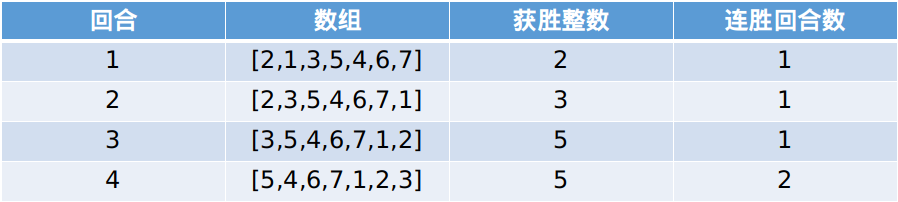

# 1535. 找出数组游戏的赢家

> [!quote] 题目地址
> [1535. 找出数组游戏的赢家 - 力扣（LeetCode）](https://leetcode-cn.com/problems/find-the-winner-of-an-array-game/description/)

## 题目

给你一个由 **不同** 整数组成的整数数组 $arr$ 和一个整数 $k$ 。

每回合游戏都在数组的前两个元素（即 $arr[0]$ 和 $arr[1]$ ）之间进行。比较 $arr[0]$ 与 $arr[1]$ 的大小，较大的整数将会取得这一回合的胜利并保留在位置 $0$ ，较小的整数移至数组的末尾。当一个整数赢得 $k$ 个连续回合时，游戏结束，该整数就是比赛的 **赢家** 。

返回赢得比赛的整数。

题目数据 **保证** 游戏存在赢家。

### 示例

> [!example]+ 示例 1
> **输入**：`arr = [2,1,3,5,4,6,7], k = 2`
> **输出**：`5`
> **解释**：一起看一下本场游戏每回合的情况：
> 
> 因此将进行 4 回合比赛，其中 5 是赢家，因为它连胜 2 回合。

> [!example]+ 示例 2
> **输入**：`arr = [3,2,1], k = 10`
> **输出**：`3`
> **解释**：3 将会在前 10 个回合中连续获胜。

> [!example]+ 示例 3
> **输入**：`arr = [1,9,8,2,3,7,6,4,5], k = 7`
> **输出**：`subStr[outPutIndex[1]:]`

> [!example]+ 示例 4
> **输入**：`arr = [1,11,22,33,44,55,66,77,88,99], k = 1000000000`
> **输出**：`subStr[outPutIndex[1]:]`

### 约束

> [!caution]+ 约束
> - $2 \lt= arr.length \lt= 10^5$
> - $1 \lt= arr[i] \lt= 10^6$
> - $1 \lt= k \lt= 10^9$

### 提示

> [!hint]- 提示 1
> If k ≥ arr.length return the max element of the array.

> [!hint]- 提示 2
> If k < arr.length simulate the game until a number wins k consecutive games.

## 题解

### 我的题解

### 模拟，附若干进阶问题（Python/Java/C++/Go/JS/Rust）

> [!quote] 原题解链接
> [模拟，附若干进阶问题（Python/Java/C++/Go/JS/Rust）](https://leetcode.cn/problems/find-the-winner-of-an-array-game/solutions/2773465/mo-ni-fu-ruo-gan-jin-jie-wen-ti-pythonja-zx17/?envType=daily-question&envId=2024-05-20)

由于较小的元素会移至数组的末尾，在重新遇到被移至数组末尾的元素之前，$\textit{arr}$ 的每个元素都会被访问到。

考察游戏执行的流程，本质上是在从左到右遍历 $\textit{arr}$，求数组最大值（打擂台）。我们要找**首个**连续 $k$ 回合都是最大值的数。

示例 1 的 $\textit{arr}=[2,1,3,5,4,6,7],\ k=2$，从左到右遍历的过程中，历史最大值依次为 $2,3,5,6,7$，其中元素 $5$ 是首个连续 $k$ 回合都是最大值的数。

> 注：如果把下标 $0$ 也算上的话，$\textit{arr}[0]=2$ 要连续 $k+1=3$ 个回合都是最大值才能算作答案。

如果遍历完 $\textit{arr}$ 也没找到这样的数，那么答案就是 $\textit{arr}$ 的最大值 $\textit{mx}$，因为此时比 $\textit{mx}$ 小的数都会移到 $\textit{mx}$ 的右边，所以后面比大小都是 $\textit{mx}$ 胜利。

具体算法如下：

1. 初始化 $\textit{mx}=\textit{arr}[0],\ \textit{win}=0$，从 $\textit{arr}[1]$ 开始遍历数组。其中 $\textit{win}$ 用来统计 $\textit{mx}$ 连续多少个回合是最大值（获胜）。
2. 如果 $\textit{arr}[i]>\textit{mx}$，更新 $\textit{mx}=\textit{arr}[i]$ 以及 $\textit{win}=0$。
3. 把 $\textit{win}$ 加一，如果 $\textit{win}=k$ 就退出循环。
4. 遍历结束（或者中途退出循环），返回 $\textit{mx}$。

> 注：由于从 $\textit{arr}[1]$ 开始遍历没法用 foreach 语法糖，也可以初始化 $\textit{win}=-1$，从 $\textit{arr}[0]$ 开始遍历。

```py [sol-Python3]
class Solution:
    def getWinner(self, arr: List[int], k: int) -> int:
        mx = arr[0]
        win = -1  # 对于 arr[0] 来说，需要连续 k+1 个回合都是最大值
        for x in arr:
            if x > mx:  # 新的最大值
                mx = x
                win = 0
            win += 1  # 获胜回合 +1
            if win == k:
                break
        return mx
```

```java [sol-Java]
class Solution {
    public int getWinner(int[] arr, int k) {
        int mx = arr[0];
        int win = 0;
        for (int i = 1; i < arr.length && win < k; i++) {
            if (arr[i] > mx) { // 新的最大值
                mx = arr[i];
                win = 0;
            }
            win++; // 获胜回合 +1
        }
        return mx;
    }
}
```

```cpp [sol-C++]
class Solution {
public:
    int getWinner(vector<int>& arr, int k) {
        int mx = arr[0], win = 0;
        for (int i = 1; i < arr.size() && win < k; i++) {
            if (arr[i] > mx) { // 新的最大值
                mx = arr[i];
                win = 0;
            }
            win++; // 获胜回合 +1
        }
        return mx;
    }
};
```

```c [sol-C]
int getWinner(int *arr, int arrSize, int k) {
    int mx = arr[0], win = 0;
    for (int i = 1; i < arrSize && win < k; i++) {
        if (arr[i] > mx) { // 新的最大值
            mx = arr[i];
            win = 0;
        }
        win++; // 获胜回合 +1
    }
    return mx;
}
```

```go [sol-Go]
func getWinner(arr []int, k int) int {
    mx := arr[0]
    win := 0
    for i := 1; i < len(arr) && win < k; i++ {
        if arr[i] > mx { // 新的最大值
            mx = arr[i]
            win = 0
        }
        win++ // 获胜回合 +1
    }
    return mx
}
```

```js [sol-JavaScript]
var getWinner = function(arr, k) {
    let mx = arr[0];
    let win = 0;
    for (let i = 1; i < arr.length && win < k; i++) {
        if (arr[i] > mx) { // 新的最大值
            mx = arr[i];
            win = 0;
        }
        win++; // 获胜回合 +1
    }
    return mx;
};
```

```rust [sol-Rust]
impl Solution {
    pub fn get_winner(arr: Vec<i32>, k: i32) -> i32 {
        let mut mx = arr[0];
        let mut win = -1; // 对于 arr[0] 来说，需要连续 k+1 个回合都是最大值
        for &x in &arr {
            if x > mx { // 新的最大值
                mx = x;
                win = 0;
            }
            win += 1; // 获胜回合 +1
            if win == k {
                break;
            }
        }
        mx
    }
}
```

#### 复杂度分析

- 时间复杂度：$\mathcal{O}(n)$，其中 $n$ 为 $\textit{nums}$ 的长度。
- 空间复杂度：$\mathcal{O}(1)$。

## 进阶问题

1. 返回一个长为 $n$ 的数组 $\textit{answer}$，其中 $\textit{answer}[i]$ 等于删除 $\textit{arr}[i]$ 后，剩余 $n-1$ 个数按照原题计算出的答案。输入保证 $n\ge 3$。
2. 在原问题的基础上，额外输入一个长为 $q\ (q \le 10^5)$ 的询问数组 $\textit{queries}$，其中 $\textit{queries}[i] = [\textit{left}_i, \textit{right}_i]$。返回一个长为 $q$ 的数组 $\textit{answer}$，其中 $\textit{answer}[i]$ 等于把 $\textit{arr}$ 的下标在 $[\textit{left}_i, \textit{right}_i]$ 的这一段连续子数组，按照原题计算出的答案。保证子数组长度至少为 $2$。
3. 在 2 的基础上，如果还可以修改 $\textit{arr}[i]$，要怎么做？（单点修改，保证修改后 $\textit{arr}$ 元素仍然互不相同。）

欢迎在评论区分享你的思路/代码。

## 分类题单

1. [滑动窗口（定长/不定长/多指针）](https://leetcode.cn/circle/discuss/0viNMK/)
2. [二分算法（二分答案/最小化最大值/最大化最小值/第K小）](https://leetcode.cn/circle/discuss/SqopEo/)
3. [单调栈（矩形系列/字典序最小/贡献法）](https://leetcode.cn/circle/discuss/9oZFK9/)
4. [网格图（DFS/BFS/综合应用）](https://leetcode.cn/circle/discuss/YiXPXW/)
5. [位运算（基础/性质/拆位/试填/恒等式/贪心/脑筋急转弯）](https://leetcode.cn/circle/discuss/dHn9Vk/)
6. [图论算法（DFS/BFS/拓扑排序/最短路/最小生成树/二分图/基环树/欧拉路径）](https://leetcode.cn/circle/discuss/01LUak/)
7. [动态规划（入门/背包/状态机/划分/区间/状压/数位/数据结构优化/树形/博弈/概率期望）](https://leetcode.cn/circle/discuss/tXLS3i/)
8. [常用数据结构（前缀和/差分/栈/队列/堆/字典树/并查集/树状数组/线段树）](https://leetcode.cn/circle/discuss/mOr1u6/)

欢迎关注 [B站@灵茶山艾府](https://space.bilibili.com/206214)

[我的题解精选（已分类）](https://github.com/EndlessCheng/codeforces-go/blob/master/leetcode/SOLUTIONS.md)
